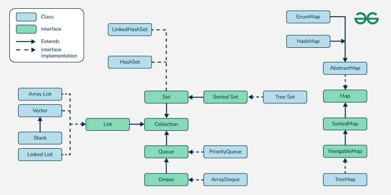
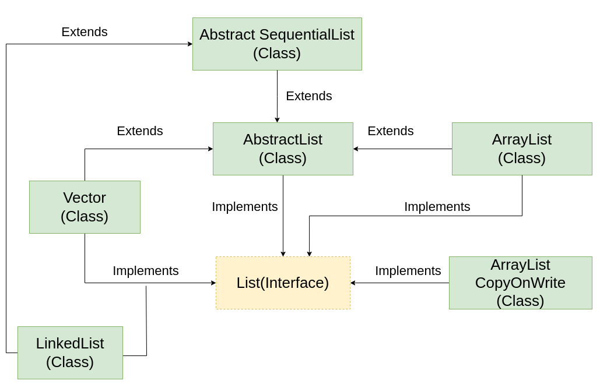

# Java Collections

Any group of individual objects that are represented as a single unit is known as a Java Collection of Objects.
In Java, the Collection interface (java.util.Collection) and Map interface (java.util.Map) are the two main “root” interfaces of Java collection classes.

What You Should Learn in Java Collections?

- List Interface
    Abstract List Class
    Abstract Sequential List Class
    Array List
    Vector Class
    Stack Class
    LinkedList Class

- Queue Interface
    Blocking Queue Interface
    AbstractQueue Class
    PriorityQueue Class
    PriorityBlockingQueue Class
    ConcurrentLinkedQueue Class
    ArrayBlockingQueue Class
    DelayQueue Class
    LinkedBlockingQueue Class
    LinkedTransferQueue
  
- Deque Interface
    BlockingDeque Interface
    ConcurrentLinkedDeque Class
    ArrayDeque Class
    
- Set Interface
    Abstract Set Class
    CopyOnWriteArraySet Class
    EnumSet Class
    ConcurrentHashMap Class
    HashSet Class
    LinkedHashSet Class
    
- SortedSet Interface
    NavigableSet Interface
    TreeSet
    ConcurrentSkipListSet 
    Class
    
- Map Interface
    SortedMap Interface
    NavigableMap Interface
    ConcurrentMap Interface
    TreeMap Class
    AbstractMap Class
    ConcurrentHashMap Class
    EnumMap Class
    HashMap Class
    IdentityHashMap Class
    LinkedHashMap Class
    HashTable Class
    Properties Class
    
- Other Important Concepts
    How to convert HashMap to ArrayList
    Randomly select items from a List
    How to add all items from a collection to an ArrayList
    Conversion of Java Maps to List
    Array to ArrayList Conversion
    ArrayList to Array Conversion
    Differences between Array and ArrayList

- Class: A class is a user-defined blueprint or prototype from which objects are created. It represents the set of properties or methods that are common to all objects of one type.

- Interface: Like a class, an interface can have methods and variables, but the methods declared in an interface are by default abstract (only method signature, nobody). Interfaces specify what a class must do and not how. It is the blueprint of the class.

Interfaces that Extend the Java Collections Interface
- Iterable Interface
- Collection Interface
- List Interface
- Queue Interface
- Set Interface
- SortedSet Interface
- Map Interface