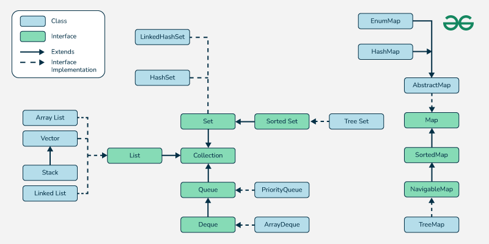
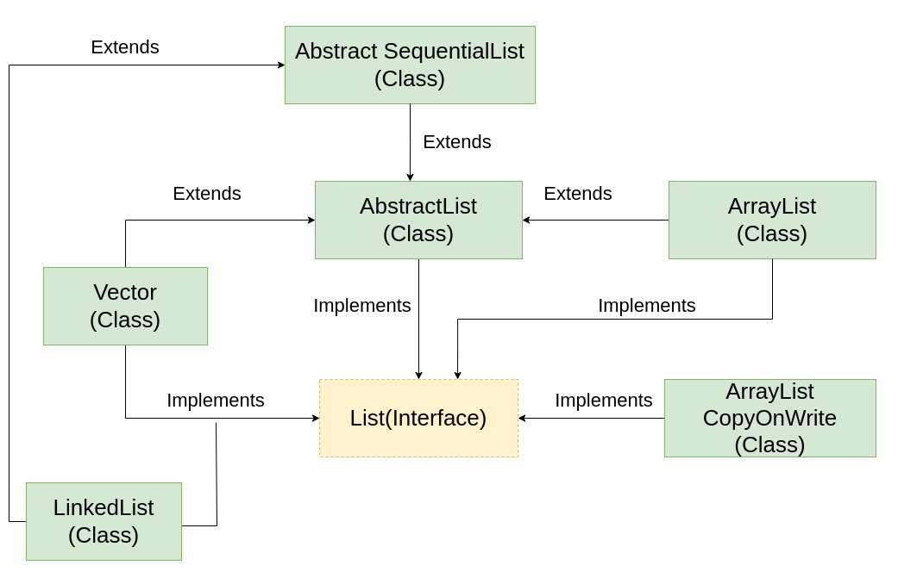

# Sorting Techniques

# Selection Sort

Selection - Select minimums.
- Look at the entire array & select minimum. 
E.g. Array -> 13, 46, 24, 52, 20, 9
- Place 9 at the beginning, i.e. swap 9 with 13 -> 
9| 46, 24, 52, 20, 13
Select the minimum from the unsorted portion of array(46, 24, 52, 20, 13): 13 & place it at beginning
- 9, 13| 24, 52, 20, 46. Swap 13 with 46
Repeat this process for the entire array.
- 9, 13, 20| 52, 24, 46
- 9, 13, 20, 24| 52, 46
- 9, 13, 20, 24, 46| 52

# Bubble Sort

- Push the maximum element to the Last by Adjacent Swaps
- Eg: 13,46,24,52,20,9
- 13<46 ? - Yes, leave them
- 46<24 ? - No, swap them -> 13,24,46,52,20,9
- 46<52 ? - Yes, leave them 
- 52<20 ? - No, swap them -> 13,24,46,20,52,9
- 52<9 ? - No, swap them -> 13,24,46,20,9,52
- So, the max element is sorted at the Last
- Now, continue this process for (n-1) elements of the array

# Insertion Sort

Takes an element & places it in its correct position

- E.g 14,9,15,12,6,8,13
- Is 9 at the correct position in (14,9) ? - No, so swap them
- 9,14,15,12,6,8,13. Now take (9,14,15). Is 15 at the correct position ? - Yes. So, keep it as it is
- Take (9,14,15,12). Is 12 at the right position for size 4 ? - No. Swap 15-12, 14-12.
- Take (9,12,14,15,6). Is 6 at the correct position? - No. Swap 15-6,14-6,12-6,9-6.
- Take (6,9,12,14,15,8). Is 8 at the right position? - No. Swap 15-8,14-8,12-8,9-8.
- Take (6,8,9,12,14,15,13). Is 13 at the right position? - No. Swap 15-13,14-13
 

# Merge Sort

- Divide & Merge. Eg: [3,1,2,4,1,5,2,6,4]
- Divides the array(hypothetically) into 2 parts - 5 parts & 4 parts OR 4 parts & 5 parts
- Let's take into 5 parts & 4 parts - [3,1,2,4,1] & [5,2,6,4]
- Now divide the 5 part array into 2 parts - 3|2. [3,1,2] & [4,1]
- Again,[3,1] & [2]. [3] & [1].
- Now, merge [3] & [1] in a sorted manner into a single array.
- Now, merge [1,3] & [2] & merge both into a single array - [1,2,3]
- [4,1] - Divided into [4] & [1]. Now, merge them in a sorted manner - [1,4]
- Now, merge [1,2,3] & [1,4] - [1,1,2,3,4].
- 1st half is sorted, now onto the 2nd half
- Divide into 2 parts - [5,2] & [6,4]
- Again, divide into 2 parts - [5] & [2], [6] & [4].
- Now, merge them - [2,5] & [4,6]. Now merge them - [2,4,5,6]
- How to Merge ? - Take 2 pointers for the 2 arrays, keep comparing 1pointer with other pointer, pick the min element, move pointer of that array to next element, keep on doing this

